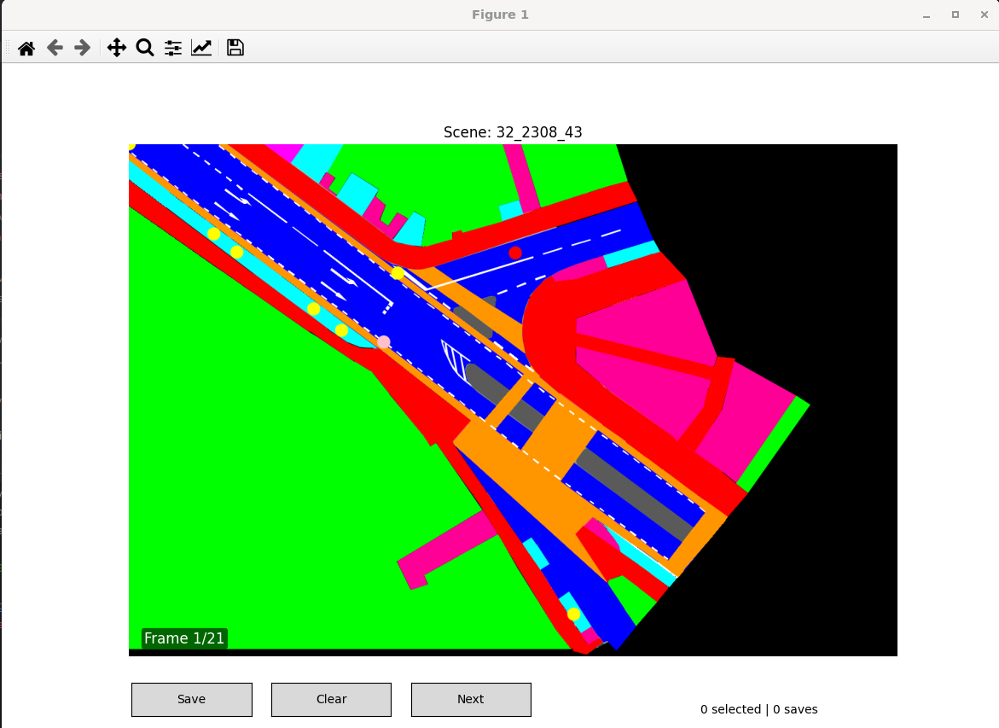

# Extract Visibility Data from inD dataset

This source code is based on https://github.com/ika-rwth-aachen/drone-dataset-tools

Its purpose was to visualize the trajectories from inD dataset. 
We extended the original code to do three main tasks to extract visibility annotations:

1. For each vehicle in each frame, determine which other road users are visible from the ego vehicle's perspective.
2. For randomly selected ego vehicle for each scene, calculate trajectories of visible road users, and Occluded Grid Map data.
3. Using data generated by the two steps, create a visualization tool that facilitates the manual annotation of visibility status for selected ego vehicle.

Here, we provide source code in Python these three main tasks. 

## Installation and Quick Start

1. Create a new Python environment or select a pre-existing one. 
   This code is tested with Python 3.8, but is very probably compatible with newer releases of Python.

   If you use Anaconda3, this can be done as follows:
   ```shell 
   conda create --name vstsbgat python=3.8
   conda activate vstsbgat
   ```

2. Install required packages by navigating to the root directory and using. This will install all packages that is utilized in above three tasks, as well as model training and evaluation for occlusion inference.
    ```shell 
    pip3 install -r requirements_vstsbgat.txt
    ```
3. First, you need to execute the first task: extract visibility data for all vehicles in all frames. 
   You can do this by running the following command from the `src` directory:
   ```shell
   python3 src/visibility_extraction.py --dataset_dir /<path/to>/inD-dataset-v1.0/data/ --start_recording_id 0 --end_recording_id 32
   ```
   Here, replace `/<path/to>/inD-dataset-v1.0/data/` with the actual path to the `data/` directory of the inD dataset on your machine.
   start_recording_id and end_recording_id specify the range of recordings to process (0-32 for inD dataset).
4. Second, you need to execute the second task: generate visibility trajectories and Occluded Grid Map data for randomly selected ego vehicles.
   ```shell
   python3 src/create_observation_data.py --dataset_dir /<path/to>/inD-dataset-v1.0/data/ --history_length 20 --start_recording_id 32 --end_recording_id 32
   ```
   Here, replace `/<path/to>/inD-dataset-v1.0/data/` with the actual path to the `data/` directory of the inD dataset on your machine.
   start_recording_id and end_recording_id specify the range of recordings to process (0-32 for inD dataset). 
   history_length specifies the number of past frames to include in the observation data.

5. Then, you can use the visualization tool to manually annotate visibility status for selected ego vehicles.
   ```shell
   python3 src/annotate_data.py --dataset_dir /<path/to>/inD-dataset-v1.0/data/ --history_length 20 --start_recording_id 32 --end_recording_id 32 --start_frame 2000 --observation_data_file ../data/observations_32_32.pkl
   ```
   Here, replace `/<path/to>/inD-dataset-v1.0/data/` with the actual path to the `data/` directory of the inD dataset on your machine.
    start_recording_id and end_recording_id specify the range of recordings to process (0-32 for inD dataset).
    history_length specifies the number of past frames to include in the observation data.
    start_frame specifies the frame number to start the annotation from.

 | Keyboard Shortcut | Description |
|-------------------| --- |
| right arrow/ D    | Jump to next frame |
| left arrow/ A     | Jump to previous frame |




## Citation

If you use one of our datasets or these scripts in your work, please cite our datasets as follows:
### inD Paper
```
@INPROCEEDINGS{inDdataset,
               title={The inD Dataset: A Drone Dataset of Naturalistic Road User Trajectories at German Intersections},
               author={Bock, Julian and Krajewski, Robert and Moers, Tobias and Runde, Steffen and Vater, Lennart and Eckstein, Lutz},
               booktitle={2020 IEEE Intelligent Vehicles Symposium (IV)},
               pages={1929-1934},
               year={2019},
               doi={10.1109/IV47402.2020.9304839}}
```
